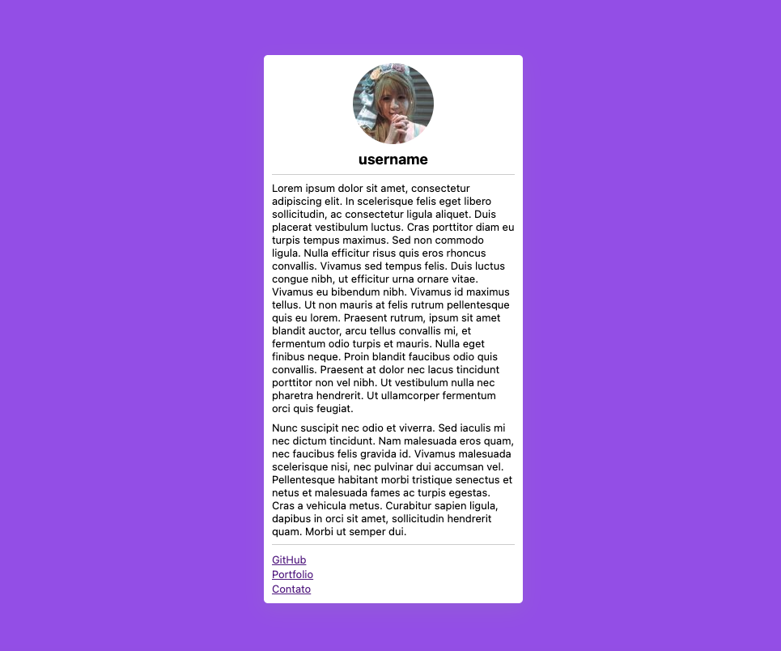

# Prática: Layout com CSS Flexbox

Nesta prática, a tarefa será recriar visualmente, na tela do navegador, o que consta na imagem acima. Deverá ser usado CSS Flexbox nesta construção.

Practice: Layout with CSS Flexbox

In this practice, the task will be to visually recreate what is shown in the image above on the browser screen. CSS Flexbox should be used for this construction.